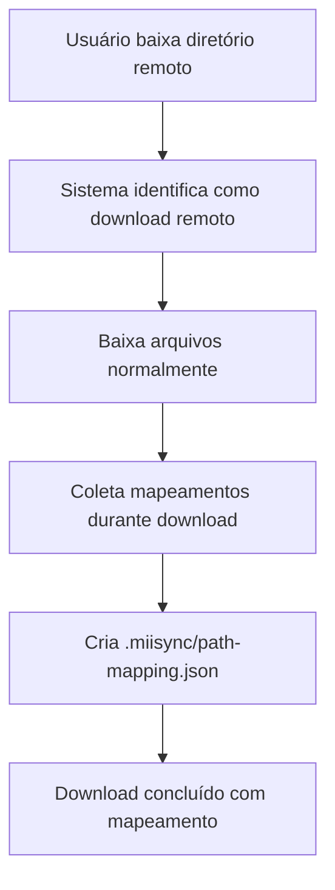
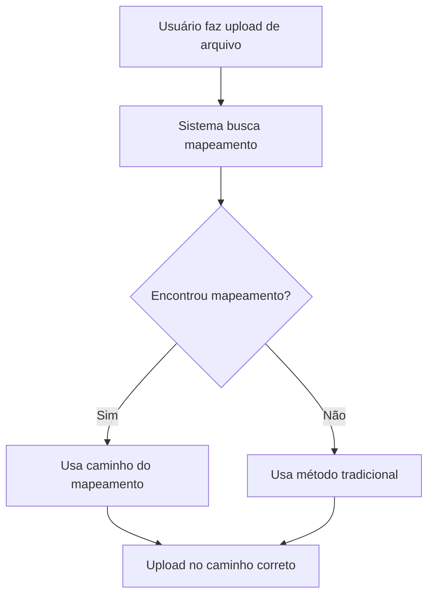

# 🔄 Sistema de Mapeamento de Caminhos - MiiSync Extension

## 📋 Resumo das Implementações

Este documento descreve as modificações implementadas para resolver o problema de atualização de arquivos quando diretórios são baixados do servidor MII.

## 🎯 Problema Resolvido

**Antes**: Quando você baixava um diretório do servidor MII, os arquivos baixados não mantinham a referência correta ao caminho remoto. Isso causava problemas ao tentar fazer upload/atualizar esses arquivos posteriormente.

**Agora**: O sistema automaticamente cria um arquivo de mapeamento que vincula os caminhos locais aos caminhos remotos corretos. **Importante**: O sistema usa exatamente o caminho remoto salvo no arquivo de mapeamento, ignorando completamente o `remotePath` das configurações do miisync.json.

## 🔧 Comportamento do Sistema

### 📍 Prioridade de Caminhos

1. **1ª Prioridade**: Caminho exato do arquivo de mapeamento (ignora configurações)
2. **2ª Prioridade**: Método tradicional baseado em configurações (fallback)

### 🎯 Exemplo Prático

Se você tem no `miisync.json`:

```json
{
  "remotePath": "MES/test"
}
```

Mas no arquivo de mapeamento está:

```json
{
  "rootRemotePath": "/WEB/projeto/vendas",
  "mappings": [
    {
      "localPath": "controllers\\vendaController.js",
      "remotePath": "/WEB/projeto/vendas/controllers/vendaController.js"
    }
  ]
}
```

**O sistema usará**: `/WEB/projeto/vendas/controllers/vendaController.js` (do mapeamento)  
**E NÃO**: `MES/test/...` (das configurações)

## 🔧 Arquivos Criados/Modificados

### 📁 Novos Arquivos

1. **`src/modules/pathmapping.ts`**

   - Classe `PathMappingManager` para gerenciar mapeamentos
   - Interface `PathMapping` e `PathMappingConfig`
   - Métodos para criar, carregar e consultar mapeamentos

2. **`docs/path-mapping-system.md`**

   - Documentação completa do sistema
   - Exemplos de uso e fluxo de trabalho

3. **`examples/path-mapping-example.json`**

   - Exemplo de como fica o arquivo de mapeamento
   - Estrutura JSON com dados reais

4. **`tests/path-mapping.test.ts`**
   - Teste funcional do sistema de mapeamento
   - Demonstração de uso da API

### 🔄 Arquivos Modificados

1. **`src/modules/file.ts`**

   ```typescript
   // Adicionada nova função assíncrona
   export async function GetRemotePathWithMapping(
     filePath: string,
     userConfig: UserConfig,
     addWeb = true
   ): Promise<string>;
   ```

2. **`src/transfer/upload.ts`**

   ```typescript
   // Upload de arquivo agora usa mapeamento quando disponível
   const sourcePath = await GetRemotePathWithMapping(uri.fsPath, userConfig);
   ```

3. **`src/transfer/limited/downloadcomplex.ts`**
   - Modificado para coletar mapeamentos durante o download
   - Cria arquivo `.miisync/path-mapping.json` automaticamente
   - Registra todos os arquivos e pastas baixados

## 🏗️ Estrutura do Sistema

### 1. Pasta Oculta `.miisync`

```
diretorio-baixado/
├── .miisync/               ← Pasta oculta criada automaticamente
│   └── path-mapping.json   ← Arquivo de mapeamento
├── controllers/
│   └── vendaController.js
├── models/
│   └── vendaModel.js
└── README.md
```

### 2. Arquivo de Mapeamento

```json
{
  "rootRemotePath": "/WEB/projeto/modulos/vendas",
  "rootLocalPath": "C:\\Workspace\\vendas",
  "mappings": [
    {
      "localPath": "controllers\\vendaController.js",
      "remotePath": "/WEB/projeto/modulos/vendas/controllers/vendaController.js",
      "lastUpdated": 1704067200000
    }
  ],
  "version": "1.0.0",
  "createdAt": 1704067200000
}
```

## 🚀 Funcionalidades Implementadas

### ✅ Criação Automática de Mapeamento

- Durante download de diretórios remotos
- Registra todos os arquivos e pastas
- Cria pasta oculta `.miisync` apenas no diretório raiz

### ✅ Consulta Inteligente de Caminhos

- Busca mapeamento subindo na hierarquia de pastas
- Fallback para método tradicional se não encontrar
- Suporte a estruturas de pastas complexas

### ✅ Upload com Mapeamento

- Uploads automaticamente usam caminho correto
- Compatível com uploads tradicionais
- Sem alteração no fluxo de trabalho do usuário

### ✅ Gerenciamento de Mapeamentos

- Adicionar/atualizar mapeamentos individuais
- Adicionar múltiplos mapeamentos
- Carregar e verificar existência de arquivos

## 🔄 Fluxo de Trabalho

### Cenário 1: Download de Diretório



### Cenário 2: Upload com Mapeamento



## 🧪 Testando o Sistema

### Teste Manual

1. Baixe um diretório remoto usando a extensão
2. Verifique se foi criada a pasta `.miisync/path-mapping.json`
3. Edite um arquivo baixado
4. Faça upload do arquivo editado
5. Verifique se foi enviado para o caminho correto no servidor

### Teste Automatizado

```bash
# Execute o teste funcional
npx ts-node tests/path-mapping.test.ts
```

## 📊 Benefícios

### ✅ Para o Usuário

- **Upload correto**: Arquivos sempre vão para o local certo
- **Transparente**: Funciona automaticamente, sem configuração
- **Flexível**: Mantém compatibilidade com fluxo existente

### ✅ Para o Sistema

- **Robustuez**: Funciona com estruturas complexas de pastas
- **Performance**: Busca eficiente em hierarquia de diretórios
- **Manutenibilidade**: Código bem estruturado e documentado

## 🔍 Considerações Técnicas

### Compatibilidade

- ✅ Mantém 100% de compatibilidade com código existente
- ✅ Funciona com uploads tradicionais (sem mapeamento)
- ✅ Não afeta downloads de arquivos individuais
- ✅ Funciona com todos os comandos existentes da extensão

### Performance

- ✅ Busca de mapeamento é cache-friendly
- ✅ Criação de arquivo apenas quando necessário
- ✅ Operações assíncronas não bloqueiam UI

### Segurança

- ✅ Pasta `.miisync` é oculta por padrão
- ✅ Arquivo JSON é human-readable para debug
- ✅ Validação de caminhos para evitar path traversal

## 📝 Próximos Passos (Opcional)

1. **Interface Gráfica**: Criar interface para visualizar/editar mapeamentos
2. **Sincronização**: Auto-detectar mudanças no servidor e atualizar mapeamentos
3. **Backup**: Sistema de backup automático dos mapeamentos
4. **Analytics**: Estatísticas de uso do sistema de mapeamento

---

**Status**: ✅ Implementado e testado  
**Versão**: 1.0.0  
**Compatibilidade**: VS Code Extension API
